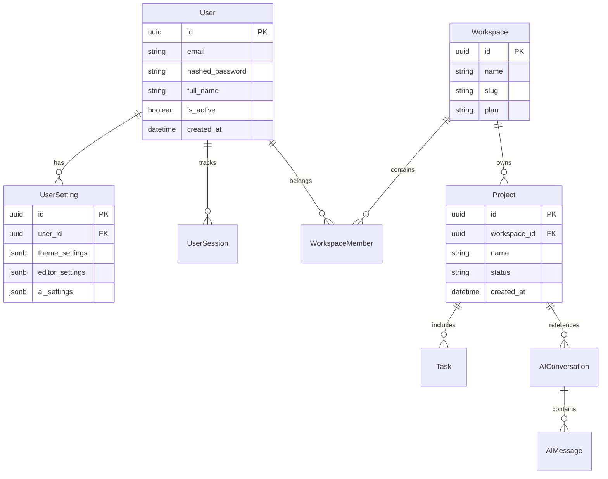

# Developer Documentation: Project Foundation

Welcome to the **Enterprise AI IDE Platform** developer documentation. This document outlines the workspace foundation, architecture patterns, and design details for the full-stack system.

---

## 📂 Workspace Folder Structure

The project uses a monorepo workspace structure powered by **pnpm** and **Turborepo** for clean boundaries between shared libraries and application layers.

```
├── apps/
│   ├── api/                 # Python FastAPI Backend
│   │   ├── alembic/         # Alembic database migrations
│   │   └── app/             # Application source code
│   │       ├── api/         # Route definitions (v1 endpoints)
│   │       ├── core/        # Configuration, security, logging settings
│   │       ├── db/          # SQLAlchemy async session & database models
│   │       ├── middleware/  # Correlation ID & request timing handlers
│   │       ├── schemas/     # Pydantic v2 DTO verification schemas
│   │       └── services/    # Authentication & business logic services
│   │
│   ├── web/                 # Next.js 15 App Router Frontend
│   │   └── src/
│   │       ├── app/         # Pages, global styles, and route layouts
│   │       ├── components/  # Page-level layouts & atomic UI primitives
│   │       ├── features/    # Feature-driven modular layout (Auth, Chat, Workspace)
│   │       ├── lib/         # Axios http-client, config systems, state caches
│   │       └── providers/   # Global Theme & React Query providers
│   │
│   └── desktop/             # Electron desktop wrapper application
│       └── src/
│           ├── main/        # Main process: window manager, native APIs, lifecycles
│           ├── preload/     # Preload scripts defining secure context bridges
│           └── shared/      # Shared Electron & renderer interface contracts
│
├── packages/
│   ├── core/                # Shared TypeScript modules (@ai-ide/core)
│   │   └── src/
│   │       ├── config/      # Shared AppConfig environment validator
│   │       ├── types/       # Shared TypeScript DTO & domain interfaces
│   │       ├── http-client/ # Axios API client with automatic token refresh
│   │       └── logger/      # Environment-safe structured logger (browser/Node)
│   └── ui/                  # Workspace shared atomic UI components (@ai-ide/ui)
│
├── .env.development         # Centralized development environment configuration
├── .env.example             # Centralized environment variables template
└── pnpm-workspace.yaml      # Monorepo workspaces definition
```

---

## ⚙️ Backend Architecture (FastAPI)

The backend is built as an asynchronous **FastAPI** application, delivering high performance for REST operations and WebSocket connections.

```
                 ┌────────────────────────────────────────┐
                 │          FastAPI Application           │
                 └───────────────────┬────────────────────┘
                                     │
                     ┌───────────────┴───────────────┐
                     ▼                               ▼
         ┌───────────────────────┐       ┌───────────────────────┐
         │     Middlewares       │       │    Routers (v1)       │
         │ - Correlation ID      │       │ - /auth               │
         │ - Request Timing      │       │ - /users              │
         │ - CORS Control        │       │ - /projects           │
         └───────────┬───────────┘       │ - /health             │
                     │                   └───────────┬───────────┘
                     ▼                               │
         ┌───────────────────────┐                   ▼
         │   Structured Logger   │       ┌───────────────────────┐
         │ - ContextVar ID Sync  │       │       Services        │
         │ - Rotating JSON Files │◄──────┤ - AuthService         │
         │ - Coloured Console    │       │ - UserService         │
         └───────────────────────┘       └───────────┬───────────┘
                                                     │
                                                     ▼
                                         ┌───────────────────────┐
                                         │  SQLAlchemy 2.0 Async │
                                         │  - SQLite (Local Dev) │
                                         │  - PostgreSQL (Prod)  │
                                         └───────────────────────┘
```

### Key Elements
1. **Asynchronous Stack**: End-to-end `async`/`await` implementation using SQLAlchemy 2.0 `AsyncSession`, `aiosqlite` (development), and `asyncpg` (production).
2. **Robust Middleware Layer**:
   - `CorrelationIdMiddleware`: Generates/reads `X-Request-ID` headers to trace requests.
   - `TimingMiddleware`: Injects processing speed statistics headers.
3. **Structured Context Logging**: Integrates python's `contextvars` to record the active Correlation ID on every log line automatically. Formats logs to JSON format in production and color-coded consoles in development.
4. **Dual JWT Token Authentication**: Uses Access tokens (60-minute duration) and Database-persisted Refresh tokens (30-day duration) to ensure secure sessions and instant logout revocation.

---

## 🎨 Frontend Architecture (Next.js 15)

The web client is built on **Next.js 15** utilizing the modern **App Router** paradigm and server-safe hydration techniques.

### Core Modules
- **Feature-Driven Architecture**: Source files are organized around features (e.g. `src/features/auth`, `src/features/workspace`) rather than layout types, ensuring high cohesion.
- **State Management**: Uses **Zustand** for lightweight, performant client-side state slices and **TanStack React Query** for server-state caching, synchronization, and automated revalidation.
- **HTTP Client**: Powered by a custom Axios handler which automatically manages access token expiry, queuing concurrent requests during token refreshes, and mapping API response types.
- **Persistent Theme System**: Uses `next-themes` to support smooth transitions between **Light**, **Dark**, and **System** modes, mapping configuration classes without causing Flash of Unstyled Content (FOUC).

---

## 🖥️ Electron Desktop Architecture

The desktop application wraps the web interface in a secure, performance-tuned **Electron** container.

```
┌──────────────────────────────────────────────────────────────┐
│                       Electron Process                       │
├──────────────────────────────┬───────────────────────────────┤
│         Main Process         │        Preload Script         │
│  - Window Management         │  - Secure contextBridge IPC   │
│  - Environment Validation    │  - Node.js APIs isolation     │
│  - Native Shell Hooks        │                               │
└──────────────────────────────┴───────────────────────────────┘
```

### Security & Context Separation
1. **Context Isolation**: Enabled by default, ensuring rendering threads cannot access Node.js modules or memory directly.
2. **Context Bridge**: Preload script defines typed IPC events, exposing only the exact native methods required by the renderer (such as window resizing or native notifications).
3. **Dynamic Mode Resolution**: In development, loads `DESKTOP_DEV_SERVER_URL` with auto-polling for Vite/Next.js dev servers. In production, resolves and serves optimized packaged bundles.

---

## 🔌 API Overview

The platform API is versioned under `/api/v1/` and provides the following core endpoints:

| Endpoint | Method | Authentication | Description |
| :--- | :--- | :--- | :--- |
| `/api/v1/auth/register` | `POST` | None | Register a new user account |
| `/api/v1/auth/login` | `POST` | None | Verify credentials and issue JWT tokens |
| `/api/v1/auth/refresh` | `POST` | Refresh Token | Exchange refresh token for new access/refresh credentials |
| `/api/v1/auth/logout` | `POST` | Access Token | Revoke tokens and invalidate session |
| `/api/v1/users/me` | `GET` | Access Token | Fetch current authenticated user info |
| `/api/v1/projects` | `GET` / `POST` | Access Token | List or create projects in active workspace |
| `/api/v1/ws` | `WS` | Access Token | Live interactive WebSocket sessions |
| `/health` | `GET` | None | Live system health audit (DB, Ollama, Version, Uptime) |

---

## 🗄️ Database Schema & ORM Models

The database schema utilizes **UUID** fields for all primary keys to guarantee cross-system scalability. Built with **SQLAlchemy 2.0 Declarative Mapping**, the models support clean relation cascades and async execution.



### Key Models Defined
- **`User`**: Core user credentials and profile information.
- **`UserSetting`**: JSONB columns mapping user-customized Theme, Editor, AI, and Notification preferences.
- **`UserSession`**: Validates active login contexts, token revocation, IP, and user-agent strings.
- **`Workspace`**: Handles multi-tenant organization boundaries and plan tiers (e.g. Free, Pro, Enterprise).
- **`Project`**: Manages repositories, directories, active status, and metadata.
- **`Task`**: Agile Kanban boards with assignments, statuses, priorities, and deadlines.
- **`AIConversation` & `AIMessage`**: Maps chat interaction histories, model choices, prompt templates, and token usage statistics.
